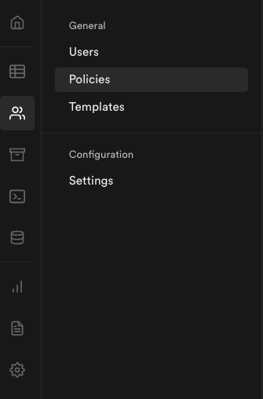

# Kickball Manager

Use [this](https://github.com/alchemycodelab/react-add-a-feature-kickball) repo as a template for your deliverable.

### Learning Objectives

- Manage row level security in Supabase by adding policies for retrieving, creating, updating and deleting rows
- Add Protected Routes in React

### Description

For this deliverable, you will need to add Row Level Security to your Supabase database as well as Protected Routes in React to secure your application.

1. Create a Supabase table called `teams` which has the following columns

   | column     |
   | ---------- |
   | id         |
   | name       |
   | city       |
   | state      |
   | created_at |

   Some seed data:

```sql
INSERT INTO teams (name, city, state)
 VALUES
 ('Rip City Kickers', 'Portland', 'OR'),
 ('Bridge City Sneakers', 'Portland', 'OR'),
 ('Lakeville Thuderfeet', 'Lake Oswego', 'OR'),
 ('Mt. Hoodies', 'Mt. Hood', 'OR');
```

2. In the "Authentication" section of Supabase enable row level security for the teams table
   

3. Add policies for INSERT, DELETE, READ and UPDATE

   | Action | Policy                             | Description                                |
   | ------ | ---------------------------------- | ------------------------------------------ |
   | READ   | `true`                             | Enable read access to all users            |
   | INSERT | `role() = 'authenticated'::text)`  | Enable insert for authenticated users only |
   | DELETE | `role() = 'authenticated'::text)`  | Enable delete for authenticated users only |
   | UPDATE | `(role() = 'authenticated'::text)` | Enable update for authenticated users only |

_Note, supabase policies can be done with a `check` or a `using` expression -- for the update to work, it needs to be on the `using` expression. See [here](https://github.com/supabase/supabase-js/issues/26#issuecomment-968882366) for details._

4. Using the provided `<ProtectedRoute>` component to properly protect the `/new`, and `/edit` routes -- users should be redirected to the sign-in page if they try to access those routes while not signed in.

### Acceptance Criteria

- An authorized user can add a new team
- An authorized user can edit an existing team
- An authorized user can delete an existing team
- Only authorized viewers should see Links to edit / delete
- Unauthorized users are redirected to sign in if they try to access the new or edit routes
- All users can view the `/teams` page
- Tests should continue to pass (you can update snapshots)

### Rubric

| Task                                                                                  | Points |
| ------------------------------------------------------------------------------------- | ------ |
| All users can see a list of teams (authorized or unauthorized)                        | 2      |
| An authorized user can create a new team                                              | 2      |
| An authorized user can edit a team                                                    | 2      |
| An authorized user can delete a team                                                  | 2      |
| Unauthorized users are redirected to sign in if they try to access new or edit routes | 2      |
